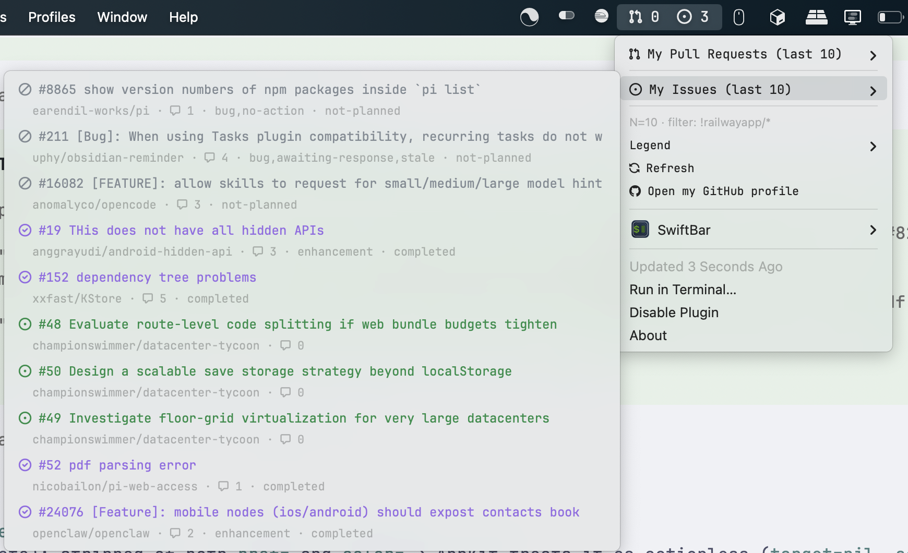
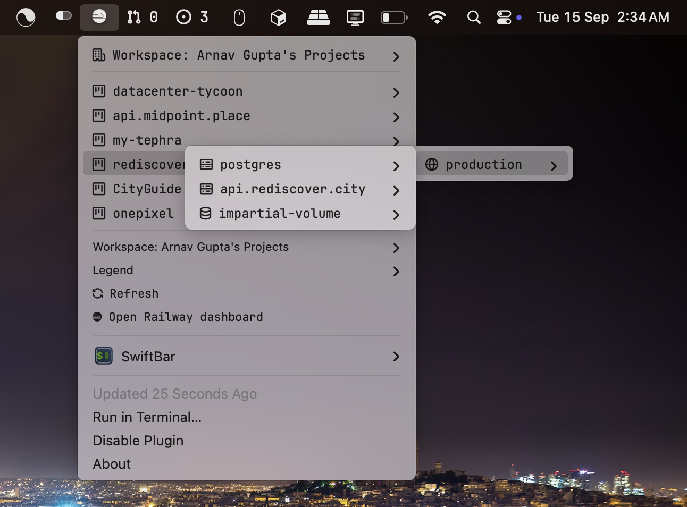

# my-swiftbar-plugins

Small menu bar plugins I actually use every day. Drop one into your plugin folder and it just shows up in the menu bar — no build step, no config files to hand-edit.

<table>
  <tr>
    <td></td>
    <td></td>
  </tr>
</table>

## Compatible apps

These scripts follow the BitBar plugin format, so they work with any app that speaks it:

- **SwiftBar** (what I use) — https://github.com/swiftbar/SwiftBar / https://swiftbar.app
- **xbar** (the maintained BitBar reboot) — https://github.com/matryer/xbar / https://xbarapp.com
- **BitBar** (the original, now archived into xbar) — https://github.com/matryer/bitbar

If a plugin header says `<xbar.*>` and `<swiftbar.*>`, that's why — same script, all three apps understand it.

## What's in here

| Plugin | What it does | Refreshes every |
| --- | --- | --- |
| `github.10m.sh` | Assigned/created issues & authored/assigned PRs, with review and CI state | 10 min |
| `railway.5m.sh` | Railway workspace → project → environment → service tree, with status and recent deploys (click a deploy to open its logs, copy database URL on DB services) | 5 min |

The refresh interval comes from the filename (`*.5m.sh` = every 5 minutes). Rename the file if you want a different cadence, e.g. `github.30m.sh`.

## Install

1. Install one of the apps above. For SwiftBar: download from [releases](https://github.com/swiftbar/SwiftBar/releases) or `brew install --cask swiftbar`.
2. Install the CLIs each plugin shells out to:
   - GitHub plugin: `brew install gh jq`, then `gh auth login`
   - Railway plugin: `brew install railway jq`, then `railway login`
3. Copy the `.sh` file(s) into your plugin folder (SwiftBar asks for this on first launch) and make them executable:
   ```sh
   chmod +x github.10m.sh railway.5m.sh
   ```
4. Hit Refresh in the menu bar. Done.

### Icons — install a Nerd Font for the best look

Both plugins auto-detect a Nerd Font and use its icons (Octicons for GitHub states, Railway + Devicons glyphs for Railway) — that's what you see in the screenshot above. Without one they fall back to SF Symbols + emoji, which works but looks plainer. So for the best icons, install a Nerd Font first — just make sure it's a proportional (**Propo**) variant, the Mono ones render too small in the menu bar:

```sh
brew install --cask font-jetbrains-mono-nerd-font
```

Any other [Nerd Font](https://www.nerdfonts.com) with a Propo variant works too — the plugins pick it up automatically on the next refresh.

## Settings

No need to edit the scripts. In SwiftBar go to Preferences → Plugins → pick the plugin → Variables, and change them there. They persist into a `.vars.json` sidecar next to the script (already gitignored here, so your personal values never get committed).

**GitHub (`github.10m.sh`)**

- `VAR_GH_ITEMS_COUNT` — how many items to list in each of the 4 lists (default `10`, clamped 1–50).
- `VAR_GH_ITEMS_REPOS` — repo filter, comma-separated. `org/repo` for one repo, `org/*` for a whole org, `!` prefix to exclude. Empty = everything. Example: `railwayapp/*,!railwayapp/mono`.
- `VAR_GH_MENUBAR_STYLE` — `split` shows PR + issue counts in the menu bar, `github` shows just the GitHub mark.

**Railway (`railway.5m.sh`)**

- `VAR_RAILWAY_WORKSPACE` — pin a workspace by name or ID. Empty (or `ALL`) = all workspaces. Easiest way to set it: use the "Workspace: …" switcher inside the menu itself, it saves back here automatically.
- `VAR_RAILWAY_DEPLOY_COUNT` — recent deploys listed per service (default `10`, clamped 1–30).

Legacy `GH_MY_ITEMS_*` / `RAILWAY_*` env vars still work as a fallback if you set them via Plugin Environment, but the `VAR_*` variables above are the way to go.

## Notes

- Each plugin is deliberately a single file (even the Nerd Font detection block that's duplicated between them) so you can install just one without anything else.
- Scripts assume Homebrew paths (`/opt/homebrew/bin`, `/usr/local/bin`) — standard Homebrew installs just work.
